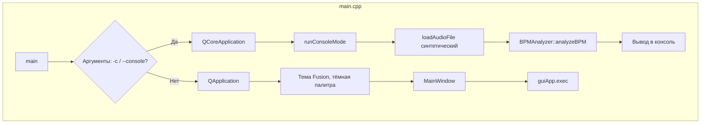
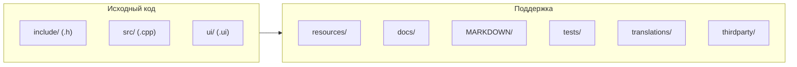
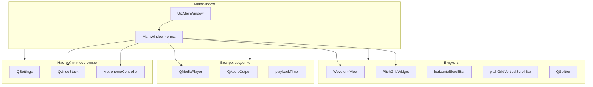
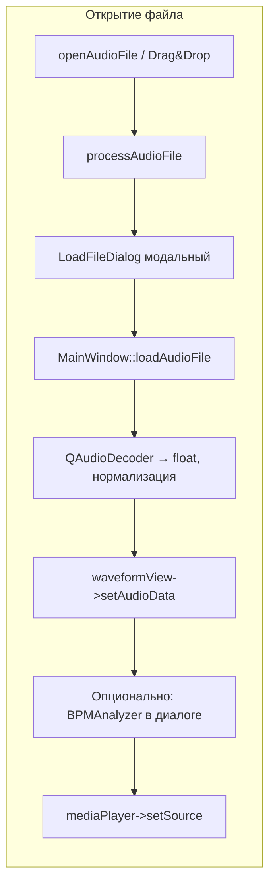
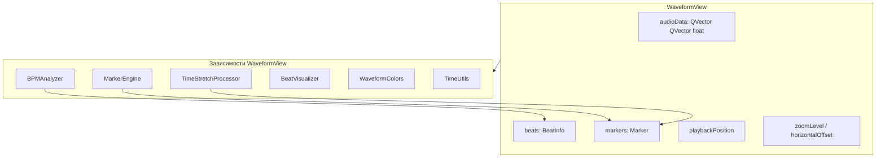
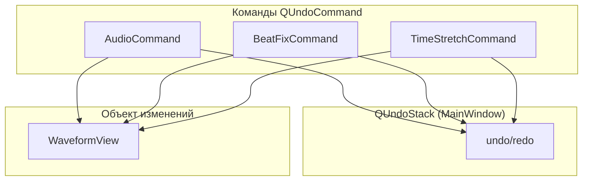
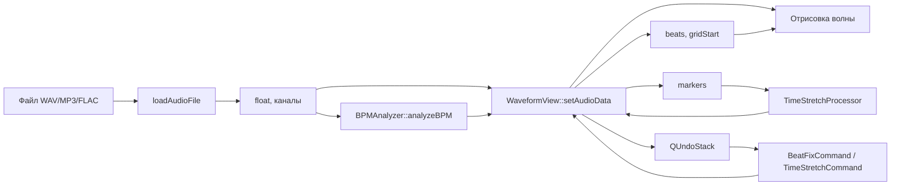
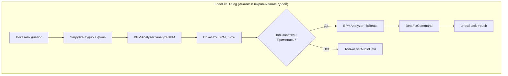
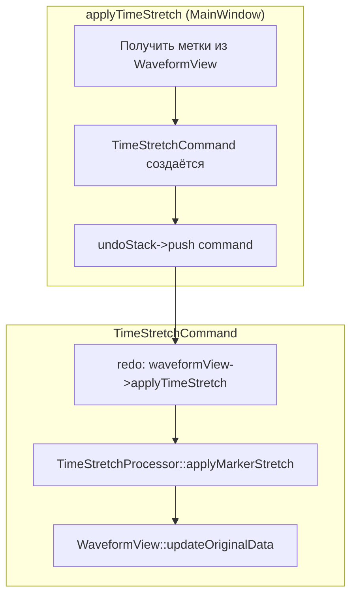
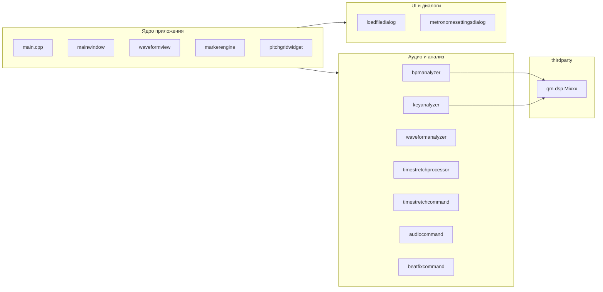

# Блок-схема проекта DONTFLOAT

Документ описывает устройство проекта: точка входа, режимы работы, связи между компонентами и потоки данных. Основан на **MARKDOWN/INIT.MD** и кодовой базе.

**Схемы в HTML** (открыть в браузере):
- [PROJECT_SCHEME.html](PROJECT_SCHEME.html) — общая схема (компоненты, потоки).
- [PROJECT_SCHEME_DETAILED.html](PROJECT_SCHEME_DETAILED.html) — сущности окон: кнопки, виджеты, поля ввода, выпадающие списки, меню.

---

## 1. Точка входа и режимы запуска

- **GUI-режим**: создаётся `QApplication`, настраивается тема и палитра, создаётся и показывается `MainWindow`, запускается event loop.
- **Консольный режим** (`-c -f <файл>`): создаётся `QCoreApplication`, загружаются (пока синтетические) данные, вызывается `BPMAnalyzer::analyzeBPM`, результат выводится в консоль.

---

## 2. Структура директорий (из INIT.MD)

- **include/** — заголовки; **src/** — реализация; **ui/** — формы Qt Designer.
- **MARKDOWN/** — техническая документация; **docs/** — пользовательская.
- **tests/** — тесты и тестовые данные; **thirdparty/** — qm-dsp (Mixxx), прочее.

---

## 3. Главное окно и подчинённые компоненты

- **MainWindow** — центр приложения: создаёт и держит все виджеты, плеер, таймер, стек отмены, метроном, читает/пишет QSettings.
- **WaveformView** — основная область: волна, метки A/B, метки растяжения, синхронизация с позицией воспроизведения.
- **PitchGridWidget** — питч-сетка (вкл. по Ctrl+G), синхронизируется с WaveformView по скроллу/зуму.

---

## 4. Загрузка и обработка аудиофайла

- Файл выбирается через меню или перетаскивание → `processAudioFile(path)`.
- Внутри: показ **LoadFileDialog** (анализ/выравнивание долей), загрузка через **loadAudioFile** (QAudioDecoder, float, каналы), передача данных в **WaveformView**, при необходимости анализ BPM в диалоге, установка источника для **QMediaPlayer** (для воспроизведения может использоваться временный WAV после обработки).

---

## 5. WaveformView: данные и зависимости

- **WaveformView** хранит: многоканальные сэмплы, массив битов (BeatInfo), массив меток (Marker из MarkerEngine), позицию воспроизведения, зум и смещение.
- Использует: **BPMAnalyzer** (биты, BPM), **MarkerEngine** (MarkerData/Marker), **TimeStretchProcessor** (applyTimeStretch по меткам), **BeatVisualizer** (опционально), **WaveformColors**, **TimeUtils**.

---

## 6. Система команд (Command Pattern)

- **AudioCommand** — смена аудиоданных в WaveformView (старые/новые данные), отмена/повтор через стек.
- **BeatFixCommand** — подмена данных на выровненные по долям (использует BPMAnalyzer::fixBeats и анализ); создаётся в процессе диалога «Анализ и выравнивание долей», пушится в **undoStack**.
- **TimeStretchCommand** — применение сжатия/растяжения по меткам (Ctrl+T): сохраняет состояние меток и аудио, вызывает **TimeStretchProcessor** через WaveformView, пушится в **undoStack**.

---

## 7. Поток данных: от файла до отображения и отмены

- Файл → загрузка в float → WaveformView (и при необходимости временный WAV для плеера).
- Отдельно: BPM-анализ → биты и gridStart в WaveformView → отрисовка сетки/долей.
- Метки в WaveformView используются TimeStretchProcessor; команды отмены/повтора меняют данные в WaveformView через стек.

---

## 8. Анализ и исправление долей (диалог)

- В **processAudioFile** показывается **LoadFileDialog** с опциями анализа.
- После загрузки вызывается **BPMAnalyzer::analyzeBPM**; при согласии пользователя — **fixBeats** и **BeatFixCommand** в **undoStack**, иначе только установка данных в WaveformView.

---

## 9. Временное растяжение по меткам (Ctrl+T)

- Пользователь выставляет метки в WaveformView, нажимает Ctrl+T (или пункт меню).
- MainWindow создаёт **TimeStretchCommand** с текущим WaveformView и метками, пушит в **undoStack**.
- При redo команда вызывает **WaveformView::applyTimeStretch** → **TimeStretchProcessor** → обновление данных и меток в WaveformView.

---

## 10. Сборка (CMake)

- Исполняемый файл собирает все перечисленные модули; при наличии **thirdparty/mixxx/lib/qm-dsp** подключается библиотека **qm_dsp** и определяется `USE_MIXXX_QM_DSP` для BPM и тональности.

---

## Краткая сводка

| Элемент | Назначение |
|--------|------------|
| **main.cpp** | Точка входа: парсинг аргументов, GUI или консоль, создание MainWindow / runConsoleMode |
| **MainWindow** | Окно, меню, виджеты, плеер, таймер, QSettings, QUndoStack, MetronomeController |
| **WaveformView** | Волна, метки A/B, метки растяжения, биты, зум, вызов TimeStretchProcessor и визуализации |
| **PitchGridWidget** | Питч-сетка (Ctrl+G), синхронизация с WaveformView |
| **MarkerEngine** | MarkerData / Marker — данные и UI меток для растяжения |
| **TimeStretchProcessor** | Алгоритмы сжатия/растяжения по меткам (в т.ч. WSOLA) |
| **BPMAnalyzer** | BPM, биты, отклонения, fixBeats; опционально qm-dsp |
| **QUndoStack** | AudioCommand, BeatFixCommand, TimeStretchCommand — отмена/повтор |
| **LoadFileDialog** | Диалог при открытии файла: анализ и выравнивание долей, создание BeatFixCommand |
| **MetronomeController** | Метроном, синхрон с BPM, настройки громкости |

Документ можно обновлять при изменении архитектуры (синхронизация с **MARKDOWN/ARCHITECTURE.md** и **docs/** по правилам из **INIT.MD**).
