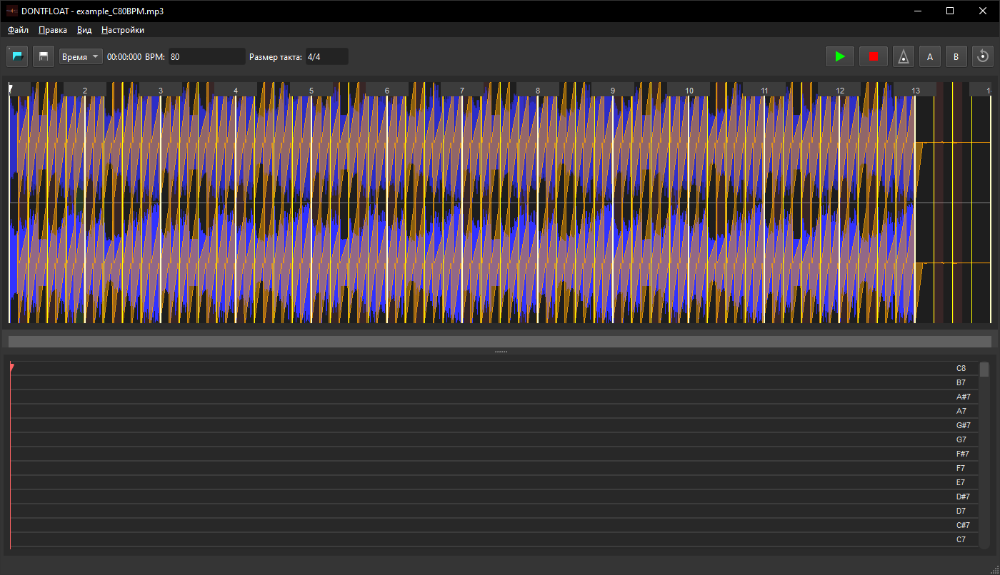

# DONTFLOAT

Профессиональный аудиоредактор с функциями анализа BPM, установки меток цикла и метрономом.

## Возможности

### 🎵 Аудио обработка
- Загрузка и воспроизведение аудиофайлов (WAV, MP3, FLAC)
- Автоматический анализ BPM с использованием алгоритмов Mixxx
- Визуализация звуковой волны в индиго цвете
- Отображение тактов и битов с настраиваемым BPM
- Анализ отклонений битов и рекомендации по исправлению

### 🎛️ Навигация и масштабирование
- Масштабирование и навигация по треку:
  - Колесико мыши для масштабирования
  - Стрелки для навигации
  - Скроллбар для быстрой прокрутки
  - Правый клик мыши для горизонтального панорамирования
- Два режима отображения времени:
  - Минуты:секунды.миллисекунды
  - Такты.доли.четверти

### 🔄 Циклы и метки
- Установка меток цикла A и B
- Визуальное отображение области цикла
- Горячие клавиши для быстрого управления
- Удаление меток через правый клик или Shift+клавиши

### 🎼 Метроном
- Встроенный метроном с настраиваемым BPM
- Визуальная и звуковая индикация
- Синхронизация с BPM трека

### 🎨 Интерфейс
- Темная тема оформления
- Прямые края скроллбаров
- Интуитивное управление
- Подсказки и статусные сообщения

## Управление

### 🎮 Основные команды
- **Воспроизведение/Пауза**: `Пробел` или `P`
- **Остановка**: `S`
- **Метроном**: `M`

### 🎯 Циклы и метки
- **Установить точку A**: `A` или ЛКМ на кнопку A
- **Установить точку B**: `B` или ЛКМ на кнопку B
- **Удалить точку A**: `Shift+A` или ПКМ на кнопку A
- **Удалить точку B**: `Shift+B` или ПКМ на кнопку B

### 🔍 Навигация и масштабирование
- **Масштабирование**: 
  - Колесико мыши вверх/вниз
  - Стрелки вверх/вниз
- **Навигация**:
  - Перетаскивание мышью (левый клик)
  - Правый клик + перетаскивание для панорамирования
  - Стрелки влево/вправо
  - Скроллбар
- **Переход к позиции**: Клик по волне

### ⚙️ BPM и анализ
- **Увеличить BPM**: `Ctrl+↑`
- **Уменьшить BPM**: `Ctrl+↓`
- **Анализ BPM**: Автоматически при загрузке файла

## Требования

### Системные требования
- **ОС**: Windows 10+, macOS 10.15+, Linux (Ubuntu 20.04+)
- **Память**: 4 GB RAM (рекомендуется 8 GB)
- **Процессор**: x64 архитектура

### Зависимости разработки
- **Qt**: 6.8+ (Core, Gui, Widgets, Multimedia)
- **CMake**: 3.16+
- **C++**: 17 или выше
- **Компилятор**: MSVC 2022, GCC 9+, Clang 12+

### Аудио форматы
- **Поддерживаемые**: WAV, MP3, FLAC
- **Частота дискретизации**: 44.1 kHz (рекомендуется)
- **Битность**: 16-bit, 24-bit, 32-bit
- **Каналы**: Моно, Стерео

## Сборка

### Быстрый старт
```bash
# Клонирование репозитория
git clone <repository-url>
cd DONTFLOAT

# Создание директории сборки
mkdir build && cd build

# Конфигурация и сборка
cmake ..
cmake --build . --config Release
```

### Детальная сборка

1. **Установите зависимости**:
   - Qt 6.8+ с модулями: Core, Gui, Widgets, Multimedia
   - CMake 3.16+
   - Компилятор C++17

2. **Клонируйте репозиторий**:
   ```bash
   git clone https://github.com/ili4yov-ika/DONTFLOAT.git
   cd DONTFLOAT
   ```

3. **Создайте директорию сборки**:
   ```bash
   mkdir build
   cd build
   ```

4. **Сконфигурируйте проект**:
   ```bash
   cmake .. -DCMAKE_BUILD_TYPE=Release
   ```

5. **Соберите проект**:
   ```bash
   cmake --build . --config Release
   ```

### Сборка с отладкой
```bash
cmake .. -DCMAKE_BUILD_TYPE=Debug
cmake --build . --config Debug
```

## Возможности

### 🎵 Анализ BPM
- Автоматическое определение BPM при загрузке
- Алгоритмы анализа от Mixxx
- Визуализация отклонений битов
- Рекомендации по исправлению ритма

### 🔄 Управление циклами
- Установка меток начала и конца цикла
- Визуальное выделение области цикла
- Горячие клавиши для быстрого доступа
- Удаление меток через контекстное меню

### 🎼 Метроном
- Синхронизация с BPM трека
- Настраиваемая громкость
- Визуальная индикация
- Автоматическое включение/выключение

## Лицензия

GNU GPL- см. файл [LICENSE](LICENSE) для деталей.

---

## Скриншот



---

## Документация

- [Архитектура](docs/architecture.md) - техническая документация
- [Горячие клавиши](docs/shortcuts.md) - справочник по управлению
- [Функции](docs/features.md) - подробное описание возможностей

