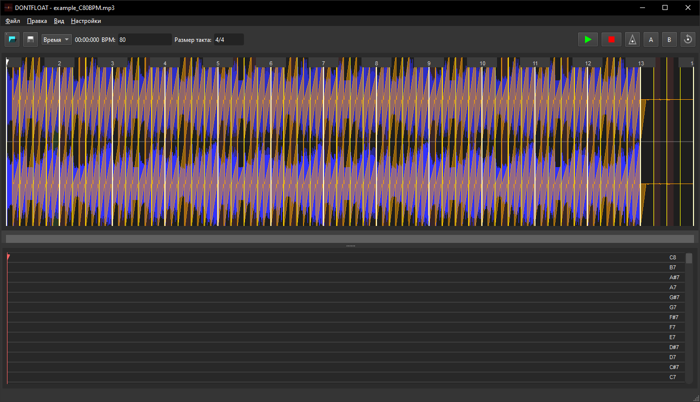

# DONTFLOAT

Аудиоредактор для выравниванием BPM (в будущем планируются ещё как питчер, аналогичный Celemony Melodyne)

## Возможности

### 🎵 Аудио обработка
- Загрузка и воспроизведение аудиофайлов (WAV, MP3, FLAC)
- Автоматический анализ BPM с использованием алгоритмов Mixxx
- Визуализация звуковой волны в индиго цвете
- Отображение битов с настраиваемым BPM; размер такта — выпадающий список (4/4, 3/4, 1/4, 2/4, 6/8, 12/8); сетка по знаменателю (4 доли для X/4, 8 для X/8)
- Анализ отклонений битов и рекомендации по исправлению
- **Визуализация отклонений битов** (при включённой опции):
  - Треугольные области: основание на фактической позиции бита, вершина на ожидаемой
  - Красный — бит позже ожидаемого (растянутая доля), синий — раньше ожидаемого (сжатая доля)
  - Порог отображения по умолчанию 2%; опционально силуэт ударных (жёлто-оранжевый)

### 🎛️ Навигация и масштабирование
- Масштабирование и навигация по треку:
  - Колесико мыши для масштабирования
  - Стрелки для навигации
  - Скроллбар для быстрой прокрутки
  - Правый клик мыши для горизонтального панорамирования
- Режим отображения времени:
  - Минуты:секунды.миллисекунды

### 🔄 Циклы и метки
- Установка меток цикла A и B
- Визуальное отображение области цикла
- Горячие клавиши для быстрого управления
- Удаление меток через правый клик или Shift+клавиши

### 🎼 Метроном
- Встроенный метроном с настраиваемым BPM
- Визуальная и звуковая индикация
- Синхронизация с BPM трека

### 🎼 Питч-сетка
⚠️ **Примечание**: Функция отключена по умолчанию. Активируйте через `Ctrl+G` или меню View.
- Сетка высот с метками нот
- Синхронизированная каретка воспроизведения
- Поля ввода тональности с контекстными меню
- Вертикальная прокрутка с динамической прозрачностью

### 🎨 Интерфейс
- Темная тема оформления
- Прямые края скроллбаров
- Интуитивное управление
- Подсказки и статусные сообщения
- Локализация: русский и английский

## Управление

### 🎮 Основные команды
- **Воспроизведение/Пауза**: `Пробел` или `P`
- **Остановка**: `S`
- **Метроном**: `T`

### 🎯 Циклы и метки
- **Установить точку A**: `A` или ЛКМ на кнопку A
- **Установить точку B**: `B` или ЛКМ на кнопку B
- **Удалить точку A**: `Shift+A` или ПКМ на кнопку A
- **Удалить точку B**: `Shift+B` или ПКМ на кнопку B
- **Добавить метку растяжения**: `M` в текущей позиции (ромбики; перетаскивание — ограничено соседними метками, мин. сегмент 50 мс)

### 🔍 Навигация и масштабирование
- **Масштабирование**:
  - Колесико мыши вверх/вниз
  - Стрелки вверх/вниз
- **Навигация**:
  - Перетаскивание мышью (левый клик)
  - Правый клик + перетаскивание для панорамирования
  - Стрелки влево/вправо
  - Скроллбар
- **Переход к позиции**: Клик по волне

### ⚙️ BPM и анализ
- **Увеличить BPM**: `Ctrl+↑`
- **Уменьшить BPM**: `Ctrl+↓`
- **Анализ BPM**: Автоматически при загрузке файла

### 🎼 Питч-сетка (⚠️ отключено по умолчанию)
- **Переключить видимость**: `Ctrl+G`
- **Выбор тональности**: Правый клик по полю тональности
- **Навигация по высотам**: Вертикальная прокрутка

### ⏱️ Сжатие-разжатие по меткам
- **Метки**: Клавиша `M` — добавить метку; перетаскивание ромбика (ограничения: мин. сегмент 50 мс, нулевая метка статична)
- **Применить эффект**: `Ctrl+T` — сжатие/растяжение по текущим меткам с тонкомпенсацией (WSOLA)
- **Отмена/повтор**: `Ctrl+Z` / `Ctrl+Y` после применения

### 🎯 Визуализация
- **Отклонения битов**: включается опцией в меню/настройках; треугольники красный/синий, порог 2%; опционально силуэт ударных

## Требования

### Системные требования
- **ОС**: Windows 10+, macOS 10.15+, Linux (Ubuntu 20.04+)
- **Память**: 4 GB RAM (рекомендуется 8 GB)
- **Процессор**: x64 архитектура

### Зависимости разработки
- **Qt**: 6.8+ (Core, Gui, Widgets, Multimedia, MultimediaWidgets)
- **CMake**: 3.16+
- **C++**: 17 или выше
- **Компилятор**: MSVC 2022, GCC 9+, Clang 12+

### Аудио форматы
- **Поддерживаемые**: WAV, MP3, FLAC
- **Частота дискретизации**: 44.1 kHz (рекомендуется)
- **Битность**: 16-bit, 24-bit, 32-bit
- **Каналы**: Моно, Стерео

## Сборка

### Быстрый старт
```bash
# Клонирование репозитория
git clone https://github.com/ili4yov-ika/DONTFLOAT.git
cd DONTFLOAT

# Создание директории сборки
mkdir build && cd build

# Конфигурация и сборка
cmake ..
cmake --build . --config Release
```

### Детальная сборка

1. **Установите зависимости**:
   - Qt 6.8+ с модулями: Core, Gui, Widgets, Multimedia
   - CMake 3.16+
   - Компилятор C++17

2. **Клонируйте репозиторий**:
   ```bash
   git clone https://github.com/ili4yov-ika/DONTFLOAT.git
   cd DONTFLOAT
   ```

3. **Создайте директорию сборки**:
   ```bash
   mkdir build
   cd build
   ```

4. **Сконфигурируйте проект**:
   ```bash
   cmake .. -DCMAKE_BUILD_TYPE=Release
   ```

5. **Соберите проект**:
   ```bash
   cmake --build . --config Release
   ```

### Сборка с отладкой
```bash
cmake .. -DCMAKE_BUILD_TYPE=Debug
cmake --build . --config Debug
```

### Сборка Windows installer (NSIS)
Для создания установщика DONTFLOAT_Setup.exe:
```batch
tools\build_windows_installer.bat
```
Требования: CMake, Qt 6.8+, NSIS. Скрипт выполняет Release-сборку, windeployqt и создаёт инсталлер в папке `tools/`. Иконка EXE генерируется из `resources/icons/logo.svg` (Inkscape + Pillow).

### Скрипты и packaging (папка tools/)
- `tools/README.md` — подробное описание всех скриптов и packaging
- `build_windows_installer.bat` + `nsis_installer.nsi` — сборка Windows installer (NSIS)
- `build_deb.sh` + `debian/` — сборка .deb пакета для Debian/Ubuntu
- `build_rpm.sh` + `rpm/` — сборка .rpm пакета для Fedora/RHEL
- `svg_to_ico.py` — генерация `resources/icons/logo.ico` из `logo.svg` для иконки EXE

## Консольный режим

- Запуск без GUI: `DONTFLOAT.exe -c -f <файл>` с опциями `--mixxx`, `--min-bpm`, `--max-bpm` и др.
- **Ограничение**: в консоли пока используются синтетические данные; полная загрузка файлов и анализ работают в GUI. Подробнее: [MARKDOWN/CONSOLE_MODE.md](MARKDOWN/CONSOLE_MODE.md).

## Лицензия

GNU GPL — см. файл [LICENSE](LICENSE).

---

## Скриншот



---

## Документация

**Пользовательская:**
- [Архитектура](docs/architecture.md) — устройство приложения
- [Горячие клавиши](docs/shortcuts.md) — управление с клавиатуры
- [Функции](docs/features.md) — описание возможностей

**Для разработки (MARKDOWN):**
- [Сводка по документации](MARKDOWN/README.md) — обзор файлов в MARKDOWN
- [Правила разработки](MARKDOWN/INIT.MD) — принципы и структура проекта
- [Архитектура](MARKDOWN/ARCHITECTURE.md) — компоненты и сборка
- [Руководство разработчика](MARKDOWN/DEVELOPMENT_GUIDE.md) — стандарты кода и сборка
- [Проблемы и планы](MARKDOWN/ISSUES_AND_PLANS.md) — баги, отключённые функции, планы
- [Консольный режим](MARKDOWN/CONSOLE_MODE.md) — запуск из командной строки
- [Time Stretch](MARKDOWN/TIMESTRETCH_FEATURE.md) — сжатие-растяжение по меткам (WSOLA)
- [Статус Mixxx](MARKDOWN/MIXXX_LIBRARIES_STATUS.md) — библиотеки qm-dsp
- [Тестирование](MARKDOWN/TESTING_GUIDE.md), [Решение проблем](MARKDOWN/TROUBLESHOOTING.md), [История разработки](MARKDOWN/DEVELOPMENT_HISTORY.md)
