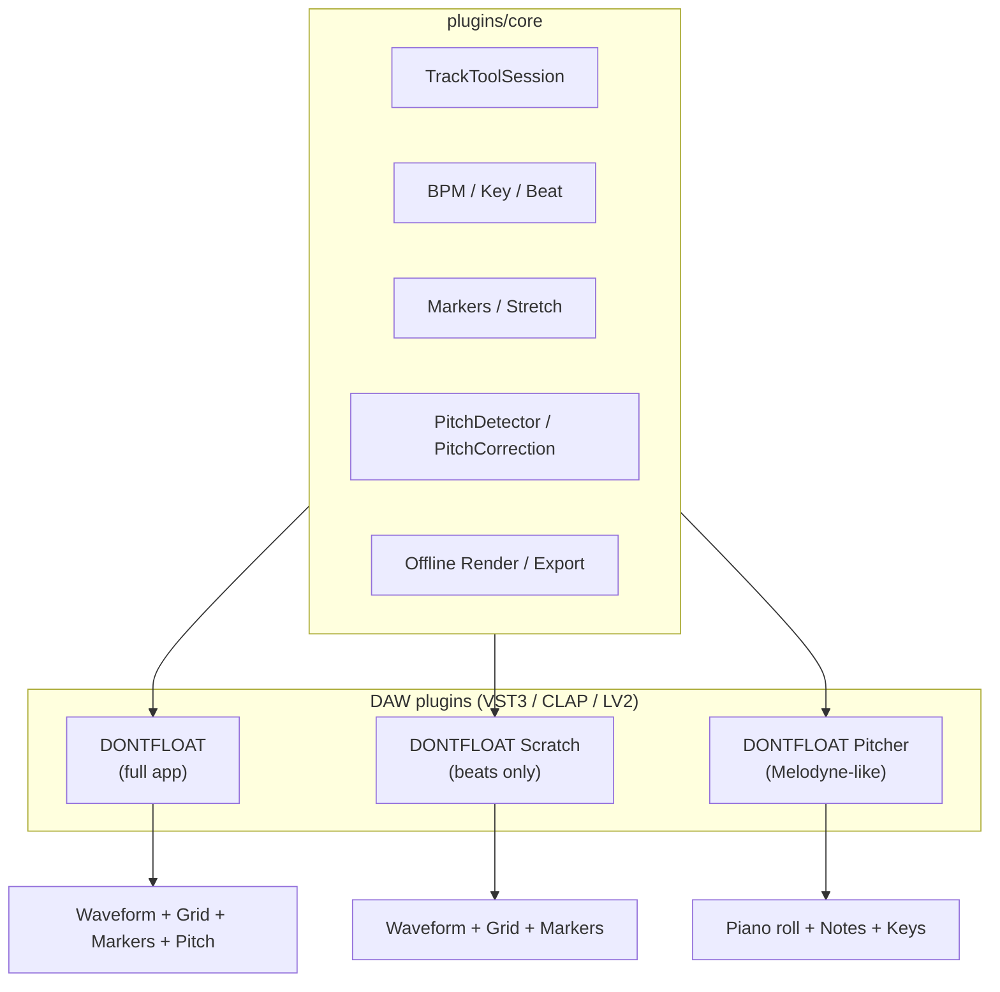
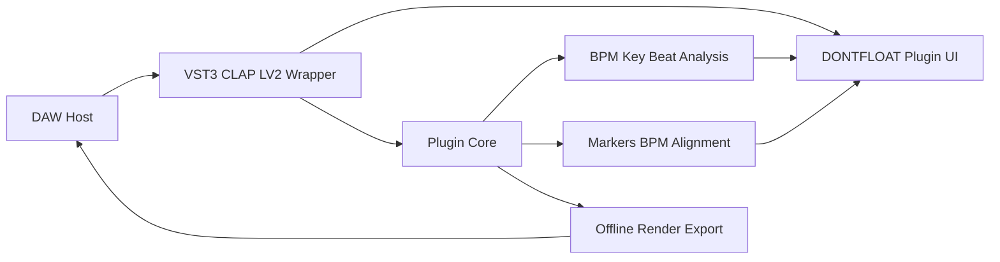

# Внешние плагины DONTFLOAT для DAW

Каталог содержит слой DAW-плагинов. По умолчанию plugin targets не собираются
и не влияют на обычный `DONTFLOAT`; включаются через CMake option
`DONTFLOAT_BUILD_PLUGINS`.

## Три вида плагинов

Продуктовая линейка для VST3 / CLAP / LV2 делится на **три отдельных плагина**.
Каждый — самостоятельный модуль в DAW со своим UI и набором функций, но все
три опираются на общий `plugins/core` и переиспользуют виджеты/DSP из основного
приложения.

| Плагин | Назначение | UI / функции | Аналог |
|--------|------------|--------------|--------|
| **DONTFLOAT** | Полная программа внутри DAW | Waveform, beat grid, метки stretch, BPM alignment, тональность, пианоролл, экспорт — тот же рабочий процесс, что в standalone `DONTFLOAT.exe` | Standalone-приложение как plugin editor |
| **DONTFLOAT Scratch** | Выравнивание долей **без** питчера | Waveform, BPM/beat grid, отклонения, stretch markers, time stretch, BPM alignment, render/export. **Без** анализа нот, пианоролла и pitch-коррекции | «Ритмическая» часть DONTFLOAT |
| **DONTFLOAT Pitcher** | Только питчер | Пианоролл, анализ f0/нот, тональность, редактирование высоты нот, pitch-коррекция, превью при drag. **Без** BPM alignment и stretch markers на волне | Melodyne |



### Разделение ответственности

**DONTFLOAT** — основной plugin target: пользователь получает в DAW тот же
инструмент, что и в desktop-приложении. Подходит, когда нужен полный цикл:
загрузка/захват аудио → анализ BPM и тональности → метки и выравнивание долей
→ при необходимости правка нот и pitch-коррекция → экспорт/render.

**DONTFLOAT Scratch** — облегчённый вариант для задач **только по ритму**:
fixed-tempo / beat grid, визуализация отклонений, drag меток stretch,
time stretch с тонкомпенсацией, выравнивание BPM. Питчер, `PitchGridWidget`,
`PitchDetector` и `PitchCorrection` в этот плагин **не входят**.

**DONTFLOAT Pitcher** — узкоспециализированный питчер, UX близкий к Melodyne:
анализ монофонического материала, блоки нот на пианоролле, вертикальный drag,
undo, live preview при редактировании, offline pitch-коррекция. Waveform с
метками stretch и BPM alignment **не входят** — только pitch-редактор.

### Форматы и имена артефактов (целевые)

Каждый продукт собирается во всех поддерживаемых форматах:

| Продукт | CLAP | LV2 bundle | VST3 |
|---------|------|------------|------|
| DONTFLOAT | `dontfloat.clap` | `dontfloat.lv2/` | `DONTFLOAT.vst3` |
| DONTFLOAT Scratch | `dontfloat_scratch.clap` | `dontfloat_scratch.lv2/` | `DONTFLOAT Scratch.vst3` |
| DONTFLOAT Pitcher | `dontfloat_pitcher.clap` | `dontfloat_pitcher.lv2/` | `DONTFLOAT Pitcher.vst3` |

Установка (Windows NSIS, целевая группа **DAW plugins**):

- CLAP → `%CommonProgramFiles%\CLAP\`
- LV2 → `%CommonProgramFiles%\LV2\`
- VST3 → `%CommonProgramFiles%\VST3\`

### Текущее состояние реализации

Сборка даёт **три отдельных продукта** × три формата (CLAP / LV2 / VST3):

| Продукт | CLAP ID | Editor |
|---------|---------|--------|
| **DONTFLOAT** | `com.dontfloat.full` | Header + Scratch (BPM/grid/markers/stretch/export) + Pitch |
| **DONTFLOAT Scratch** | `com.dontfloat.scratch` | Waveform, BPM/beat grid, align, stretch markers, export |
| **DONTFLOAT Pitcher** | `com.dontfloat.pitcher` | Пианоролл, key, анализ нот, коррекция, export |

Каждый editor показывает **имя своего продукта** в заголовке shell и в статусной строке;
`setWindowTitle` / `QApplication::setApplicationName` берутся из `PluginProductDesc`.

### Внешний вид: как в главном окне

Оформление и разметка повторяют DONTFLOAT.exe по макету
`MARKDOWN/example_plugin_dontfloat.svg`:

- **Тема** (`plugins/ui/dontfloat_plugin_theme.*`) — стиль Fusion и та же тёмная
  палитра, что в `src/main.cpp`. Если `QApplication` создали мы сами
  (`ensureQtApplication`), стиль ставится глобально; если цикл Qt крутит хост
  (мини-DAW, Qt-DAW) — красится **только поддерево редактора**, интерфейс хоста
  не трогаем.
- **Шапка** (`DontfloatPluginEditorShell`) — имя редакции слева, справа те же
  кнопки, что на панели главного окна: `OD` / `<` / `BG` / `>` и транспорт
  ▶ ■ метроном `A` `B` ↺ (32×32, иконки из `resources.qrc`). У Pitcher нет
  волны, поэтому группы сетки и цикла скрыты.
- **Содержимое** — волна со скроллбаром, поля тональностей, пианоролл и под ним
  панель разреза (`PianoRollToolbar`, клавиша `S` работает и в плагине).
  Справа на этой полосе — «Импорт MIDI» и «Экспорт MIDI», рядом с ними действия
  редакции («Выровнять доли», «Применить растяжение», «Применить коррекцию»,
  `PianoRollToolbar::addTrailingWidget`); отдельной кнопки анализа нет — он идёт сам.
- **Ноты соседней дорожки как референс**: если в этом же DAW стоит второй
  экземпляр DONTFLOAT или Pitcher, его ноты приходят фоном сюда (и наоборот).
  Экземпляры общаются через общую на процесс доску `SharedNoteBoard`
  (`plugins/core/dontfloat_shared_notes.*`): свои ноты выкладываются после
  анализа и после каждой правки, соседи забирают последнюю публикацию не от
  себя (опрос раз в 700 мс, сравнивается отметка — ноты копируются только
  когда изменились). Координаты — сэмплы таймлайна DAW, поэтому ноты встают
  на те же такты; при другой частоте дискретизации позиции пересчитываются.
  Плагин сняли с дорожки — его ноты уходят с доски. Ограничение: доска живёт
  внутри одного модуля, поэтому CLAP видит CLAP, VST3 — VST3; между форматами
  обмена нет. Импортированный вручную .mid важнее: пока он показан, ноты
  соседей не подставляются.
- **Референсный MIDI** (Pitcher): «Импорт MIDI» спрашивает, как положить ноты на
  таймлайн — оставить как есть, подогнать под BPM хоста или выровнять и подогнать
  (первая нота встаёт на начало тактовой сетки, полученной из DAW). Ноты рисуются
  серым позади своих, не редактируются и не режутся; тональности референса
  показываются потактовой полосой под полями тональностей — по одному серому
  полю на регион тактов, так что модуляция стоит на своих тактах.
- **Статусбар** — один на редактор, внизу оболочки: секции шлют текст сигналом
  `statusMessage`.
- **Размер окна**: редактор тянется хостом (CLAP — `gui.can_resize` + `get_resize_hints`,
  VST3 — `IPlugView::canResize` / `checkSizeConstraint`). Минимум хосту сообщается
  из самого редактора (`minimumSizeHint`), размеры переводятся из пикселей экрана
  в логические по `devicePixelRatio` — на мониторе с масштабом 125/150% окно
  больше не вылезает за рамку. Содержимое лежит в области прокрутки: если хост
  сжал окно сильнее разметки, появляются полосы прокрутки, а не обрезанный хвост.
- **Иконки** рисуются `QSvgRenderer` (`include/svgiconloader.h`), а не движком
  иконок Qt: у плагина внутри DAW путь поиска плагинов Qt чужой, и кнопки
  транспорта и панели разреза оставались пустыми. Рядом с бинарником плагина
  обязана лежать `Qt6Svg.dll` — это проверяет `cmake/DeployPluginQt.cmake`.

Что делают кнопки шапки: `OD` — метки по транзиентам (общий алгоритм
`MarkerUtils::detectOnsetSamples`), `<` / `>` — сдвиг тактовой сетки на долю
(с Shift — вместе с метками), `BG` — привязка меток к сетке, `A` / `B` —
точки цикла по каретке, ↺ — включение цикла, ▶ / ■ — **локальное
прослушивание** захваченной дорожки (включённый цикл ограничивает его куском
A—B), метроном тикает во время прослушивания.

> Мультимедийные объекты (прослушивание, метроном) создаются лениво, по первому
> нажатию: их инициализация при построении редактора проворачивает вложенный
> цикл событий хоста — в мини-DAW это приводило к повторному входу в загрузку
> плагина и падению.

### Захват дорожки по таймлайну и перенос клипа

Блоки от хоста пишутся **по позиции таймлайна** (`TrackToolSession::writeHostFrames`),
а не просто в конец: CLAP берёт позицию из `clap_event_transport_t`, VST3 — из
`ProcessContext::projectTimeSamples`. Захват повторяет дорожку DAW, поэтому
перед клипом лежит тишина, а его перенос виден плагину как сдвиг содержимого.
Блок, пришедший не следом за предыдущим (перемотка, повтор, перенос), начинает
новый проход: старый захват сбрасывается, иначе прошлое воспроизведение
осталось бы висеть на прежнем месте. У LV2 транспорта нет (`time:Position` не
реализован) — там блоки по-прежнему ложатся в конец.

Что делает редактор, когда поток блоков утих (400 мс):

1. Считает отпечаток содержимого — `computeContentFingerprint` (где лежит звук,
   какой он длины и хеш самого материала, не зависящий от позиции).
2. Отпечаток совпал с проанализированным — ничего не делает.
3. `detectContentShift` нашёл **тот же материал на новой позиции** — клип
   перенесли в DAW: метки растяжения, тактовая сетка, точки цикла и ноты
   сдвигаются на ту же дельту, анализ не перезапускается (правки пользователя
   сохраняются).
4. Иначе содержимое дорожки изменилось — анализ запускается заново.

Поэтому кнопок «Анализировать» / «BPM analysis» нет: анализ идёт сам при каждом
изменении содержимого дорожки. Проверка логики — тест
`tests/plugin_content_shift_test.cpp`.

> Плагин видит дорожку только тогда, когда DAW прогоняет через него звук.
> Поэтому и перенос клипа, и любое другое изменение доходят до него на
> ближайшем воспроизведении: на остановленном транспорте хост `process()` не
> зовёт и новых блоков не присылает.

### Метки растяжения и слышимый результат

- **Метки** ставятся клавишей `M` по каретке — той же, что в главном окне
  (`WaveformView::addMarker`, минимальный отрезок между метками 50 мс).
  Клавиша ловится только когда фокус в редакторе плагина
  (`Qt::WidgetWithChildrenShortcut`), чтобы не отбирать `M` у DAW. Дальше метки
  тянутся мышью, привязываются к сетке кнопкой `BG` и применяются кнопкой
  «Применить растяжение».
- **Результат слышен в DAW.** Раньше `process()` отдавал вход как есть, и правки
  жили только внутри плагина. Теперь обработанный звук кладётся в сессию
  (`TrackToolSession::setRenderedOutput`), а обёртки формата отдают его в выход:
  захват входа делается **до** этого — у хостов вход и выход часто один буфер.
  Плагин ещё и сообщает хосту, что звук пересчитан
  (`notify_output_changed` в расширении `dontfloat.transport/1`), — мини-DAW по
  этому сигналу прогоняет дорожку заново, и правки становятся слышны.

### Тактовая сетка и каретка

- **Сетка DAW → плагин.** Из транспорта читаются темп, размер такта и начало
  текущего такта (CLAP — `tempo` / `tsig_num` / `bar_start`, VST3 — `tempo` /
  `timeSigNumerator` / `barPositionMusic`), и `setHostBeatGrid` ставит их волне
  и пианороллу. Сетка плагина совпадает с сеткой хоста, снап реза и «Вдоль
  сетки» считаются по ней же.
- **Каретка плагина → DAW.** Когда каретку двигают внутри плагина (клик по
  волне или пианороллу), редактор просит хост встать туда же. Стандартного
  способа переставить транспорт из плагина в CLAP и VST3 нет, поэтому идём
  через своё расширение CLAP `dontfloat.transport/1` (`request_seek`): мини-DAW
  его отдаёт, остальные хосты возвращают `nullptr` и запрос просто теряется.
  Обратный поток (каретка DAW → плагин) защищён флагом, чтобы позиция не
  ходила по кругу.

Общая инфраструктура: `plugins/core/plugin_product.*`, `DontfloatPluginEditorShell`,
параметризованные `dontfloat_*_plugin_impl.cpp` с `DONTFLOAT_PLUGIN_PRODUCT_INDEX`,
CMake-модуль `cmake/PluginProducts.cmake`, NSIS — три артефакта в каждой секции DAW plugins.

Legacy `dontfloat_track_tool_*` targets удалены из CMake; старые исходники остаются в
репозитории для справки, но больше не собираются.

## Целевой DAW Workflow (DONTFLOAT — полная версия)

1. Пользователь ставит **DONTFLOAT** (или Scratch / Pitcher — по задаче) на
   аудио-дорожку или открывает plugin editor.
2. Плагин получает аудио от host или через offline/render workflow.
3. `plugins/core` анализирует материал (набор анализов зависит от продукта:
   Scratch — BPM/доли/markers; Pitcher — key + f0/ноты; DONTFLOAT — всё).
4. UI показывает интерфейс, соответствующий выбранному плагину (см. таблицу выше).
5. Пользователь подтверждает правки и render/export (BPM stretch и/или pitch).
6. Результат возвращается через render/export или host-specific workflow.

**DONTFLOAT Scratch:** шаги 3–5 только для ритма (без pitch).
**DONTFLOAT Pitcher:** шаги 3–5 только для нот и высоты (без меток BPM stretch).



## Форматы

### VST3
- Основной формат для Windows и macOS, также поддерживается многими DAW на Linux.
- Лучше всего подходит для редакторского UI и host integration.
- Целевые артефакты: `DONTFLOAT.vst3`, `DONTFLOAT Scratch.vst3`, `DONTFLOAT Pitcher.vst3`.
- Сейчас: SDK-gated target `dontfloat_track_tool_vst3` (MVP, зачаток Pitcher UI).

### CLAP
- Кроссплатформенный формат с современной event/model архитектурой.
- Подходит для editor/extension workflow, automation и state.
- Целевые артефакты: `dontfloat.clap`, `dontfloat_scratch.clap`, `dontfloat_pitcher.clap`.
- Сейчас: `dontfloat_track_tool_clap` — MVP с `clap.gui` и `DontfloatPitchEditor`.

### LV2
- В первую очередь Linux-экосистема и hosts с `.ttl` manifests.
- Целевые bundle: `dontfloat.lv2/`, `dontfloat_scratch.lv2/`, `dontfloat_pitcher.lv2/`.
- Сейчас: `dontfloat_track_tool_lv2` + `dontfloat_track_tool_lv2_ui` (MVP layout).

## Что уже есть в проекте

Компоненты по продуктам (переиспользуются через `plugins/core` и `plugins/ui`):

| Модуль | DONTFLOAT | Scratch | Pitcher |
|--------|:---------:|:-------:|:-------:|
| `WaveformView`, beat grid | ✅ | ✅ | — |
| `MarkerData`, stretch markers | ✅ | ✅ | — |
| `TimeStretchProcessor`, BPM alignment | ✅ | ✅ | — |
| `KeyAnalyzer` | ✅ | — | ✅ |
| `PitchGridWidget`, `PitchDetector` | ✅ | — | ✅ |
| `PitchCorrection`, note preview | ✅ | — | ✅ |
| `WavWriter`, render/export | ✅ | ✅ | ✅ |

Общие DSP/анализ-классы:

- `TimeStretchProcessor`, `RubberBandOffline` — offline/render-time сжатие и
  растяжение с тонкомпенсацией.
- `BPMAnalyzer` — BPM, beat grid, отклонения и fixed-tempo сценарии.
- `KeyAnalyzer` — основная/вторичная тональность, chroma vector и confidence.
- `MarkerData`, `MarkerEngine` — stretch markers и расчёт сегментов.
- `WavWriter` — экспорт/render результата в WAV.
- `include/granularpitchshifter_engine.h` — granular pitch shift как DSP-модуль,
  а не центральная цель продукта.

Важно: часть текущих классов использует Qt-типы (`QVector`, `QString`) и
виджеты. Для плагинов нужен слой `plugin_core` с `std::vector`, `std::string`,
plain structs и без зависимости от `MainWindow`, `QMediaPlayer` и `QSettings`.

## Предлагаемая структура

```text
plugins/
├── README.md
├── core/                          # общий API для всех трёх продуктов
├── ui/
│   ├── dontfloat_full_editor.*     # DONTFLOAT (полный UI)
│   ├── dontfloat_scratch_editor.*  # DONTFLOAT Scratch
│   ├── dontfloat_pitch_editor.*    # DONTFLOAT Pitcher (уже есть MVP)
│   └── dontfloat_qt_hosting.*
├── vst3/
│   ├── dontfloat_vst3.cpp
│   ├── dontfloat_vst3_scratch.cpp
│   └── dontfloat_vst3_pitcher.cpp
├── clap/
│   ├── dontfloat_clap.cpp
│   ├── dontfloat_clap_scratch.cpp
│   └── dontfloat_clap_pitcher.cpp
└── lv2/
    ├── dontfloat.lv2/
    ├── dontfloat_scratch.lv2/
    └── dontfloat_pitcher.lv2/
```

Текущий MVP (`dontfloat_track_tool_*`) — временная монолитная обёртка до
разделения на три target. Файлы `dontfloat_*_track_tool.*` будут переименованы
или разветвлены по мере реализации продуктовой линейки.

`core/` должен содержать DSP, анализ и сериализуемую модель проекта плагина.
Форматные обёртки (`vst3/`, `clap/`, `lv2/`) должны заниматься только API
хоста: lifecycle, editor binding, audio/offline buffers, automation, state и
форматными ограничениями.

Локальная документация:

- [`core/README.md`](core/README.md) — общий analysis/DSP/render слой без UI.
- [`vst3/README.md`](vst3/README.md) — VST3 wrappers (три продукта).
- [`clap/README.md`](clap/README.md) — CLAP wrappers (три продукта).
- [`lv2/README.md`](lv2/README.md) — LV2 bundles (три продукта).

## Сборка

По умолчанию плагины отключены. Включить:

```powershell
cmake -S . -B build/plugins -DDONTFLOAT_BUILD_PLUGINS=ON -DDONTFLOAT_BUILD_CLAP=ON -DDONTFLOAT_BUILD_LV2=ON
cmake --build build/plugins --target plugin_core_track_tool_test dontfloat_track_tool_clap dontfloat_track_tool_lv2
ctest --test-dir build/plugins -R plugin_core_track_tool_test --output-on-failure
```

Цели **сейчас** (MVP, один модуль `track_tool`):

- `dontfloat_plugin_core` — static library общего DSP API.
- `dontfloat_track_tool_clap` — CLAP module `dontfloat_track_tool.clap`.
- `dontfloat_track_tool_lv2` — LV2 module и bundle metadata.
- `dontfloat_track_tool_vst3` — VST3 target при доступном SDK.
- smoke-тесты: `plugin_core_track_tool_test`, `clap_track_tool_smoke_test`,
  `lv2_track_tool_smoke_test`, `lv2_track_tool_ui_smoke_test`.

Цели **после разделения** (×3 продукта ×3 формата = до 9 installable artifacts):

- `dontfloat_*`, `dontfloat_scratch_*`, `dontfloat_pitcher_*` для CLAP/LV2/VST3.

Дополнительные CMake-переменные:

- `DONTFLOAT_BUILD_PLUGINS=ON/OFF` — включает plugin targets.
- `DONTFLOAT_BUILD_CLAP=ON/OFF` — включает CLAP target.
- `DONTFLOAT_BUILD_LV2=ON/OFF` — включает LV2 target.
- `DONTFLOAT_BUILD_VST3=ON/OFF` — включает VST3 target при наличии SDK.
- `DONTFLOAT_CLAP_SDK_ROOT` — зарезервировано под официальный CLAP SDK.
- `DONTFLOAT_VST3_SDK_ROOT` — зарезервировано под VST3 SDK.

Установка:

- CLAP: `${CMAKE_INSTALL_LIBDIR}/clap`.
- LV2: `${CMAKE_INSTALL_LIBDIR}/lv2/dontfloat_track_tool.lv2`.
- VST3: `${CMAKE_INSTALL_LIBDIR}/vst3`, если доступен `DONTFLOAT_VST3_SDK_ROOT`.

### Обновить уже установленные плагины

После пересборки DAW продолжает грузить **старые** копии из
`%CommonProgramFiles%\CLAP|VST3|LV2` — новые кнопки и правки там не появятся.
Свежие бинарники раскладывает `tools/install_plugins_windows.ps1` (PowerShell
**от имени администратора**, Program Files иначе закрыт на запись):

```powershell
powershell -ExecutionPolicy Bypass -File tools\install_plugins_windows.ps1
```

Скрипт копирует CLAP-стабы с impl-модулями и бандлы VST3/LV2 из каталога сборки
(по умолчанию `build\Desktop_Qt_6_9_3_MSVC2022_64bit-Release`, конфигурация
`Release`). Qt-рантайм он не трогает — его кладёт установщик; ключ `-DeployQt`
дополнительно прогоняет `cmake/DeployPluginQt.cmake` рядом с CLAP. После копирования
перезапустите DAW и пересканируйте плагины.

### Windows NSIS

`tools/build_windows_installer.bat` включает `DONTFLOAT_BUILD_PLUGINS=ON`,
`DONTFLOAT_BUILD_CLAP=ON`, `DONTFLOAT_BUILD_LV2=ON` и
`DONTFLOAT_BUILD_VST3=ON`. Если переменная окружения `DONTFLOAT_VST3_SDK_ROOT`
не задана, VST3 target пропускается, а CLAP/LV2 продолжают собираться.

`tools/nsis_installer.nsi` показывает страницу компонентов. Основное приложение
устанавливается обязательно. Группа **DAW plugins** (все секции включены по
умолчанию):

**Сейчас** — один MVP на формат:

- CLAP → `%CommonProgramFiles%\CLAP\dontfloat_track_tool.clap`
- LV2 → `%CommonProgramFiles%\LV2\dontfloat_track_tool.lv2`
- VST3 → `%CommonProgramFiles%\VST3`

**Целевое** — три продукта × три формата (9 опциональных секций или
подгруппы DONTFLOAT / Scratch / Pitcher с CLAP/LV2/VST3 внутри).

## Соответствие продуктов и кода

Подробное описание трёх плагинов — в начале документа (раздел **Три вида
плагинов**). Кратко:

| Продукт | Роль | Ключевые классы UI |
|---------|------|-------------------|
| **DONTFLOAT** | Standalone в DAW | `WaveformView`, markers, `PitchGridWidget`, полный editor |
| **DONTFLOAT Scratch** | Только доли/BPM | `WaveformView`, markers, без pitch-модулей |
| **DONTFLOAT Pitcher** | Melodyne-like | `DontfloatPitchEditor`, `PitchGridWidget`, `PitchDetector` |

Режим для всех трёх: analysis + offline/render-time transform. Realtime audio
callback не выполняет тяжёлый анализ или Rubber Band R3 stretch.

## Как это должно работать

### Windows
- Windows installer собирает plugin targets и предлагает отдельную группу
  `DAW plugins` для CLAP/LV2/VST3.
- CLAP устанавливается в `%CommonProgramFiles%\CLAP`, LV2 — в
  `%CommonProgramFiles%\LV2`, VST3 — в `%CommonProgramFiles%\VST3`.
- Текущий `plugins/core` линкуется в плагины статически, поэтому CLAP/LV2 не
  требуют отдельной общей DLL рядом с приложением.
- VST3 остаётся SDK-gated: без `DONTFLOAT_VST3_SDK_ROOT` артефакт не попадёт в
  staging. После установки SDK target собирается, но пока остаётся стартовым
  wrapper, а не готовым Track Tool.

### Linux / macOS
- CLAP/LV2/VST3 bundle содержит shared library (`.so`/`.dylib`) и manifest.
- Общий DSP-код лучше линковать статически в плагин, чтобы избежать проблем с
  путями загрузчика и версиями библиотек.
- Для macOS понадобится bundle layout и подпись/нотаризация на этапе релиза.

## Ограничения и риски

- Rubber Band и qm-dsp имеют GPL-совместимые лицензии; плагин должен
  распространяться в рамках совместимой лицензии проекта.
- GUI-код (`MainWindow`, `WaveformView`, `PitchGridWidget`) нельзя тащить в
  audio callback. Для каждого из трёх продуктов — отдельный plugin editor,
  переиспользующий виджеты осознанно или через выделенную UI-модель.
- Realtime-аудио не должно выделять память, логировать в горячем пути или
  обращаться к файловой системе из callback.
- Текущий time stretch через Rubber Band используется как offline R3; для
  realtime-плагина сначала нужен отдельный streaming design.
- Нельзя обещать прямое редактирование clip в любой DAW: сначала нужно
  проектировать render/export и host-specific capabilities.

## План интеграции

1. ✅ Модель `TrackToolSession`: audio, analysis, markers, pitch notes, render state.
2. ✅ MVP host wrappers (VST3/CLAP/LV2) и `DontfloatPitchEditor` (зачаток Pitcher).
3. Разделить MVP на три продукта: CMake targets, plugin ID, factory, install rules.
4. **DONTFLOAT Pitcher** — parity с standalone-питчером (`PLAN_CREATE_A_WORKING_PITCHER.md`).
5. **DONTFLOAT Scratch** — waveform + markers editor без pitch UI.
6. **DONTFLOAT** — объединённый full editor (Scratch + Pitcher в одном plugin).
7. NSIS: группа DAW plugins с тремя продуктами (CLAP/LV2/VST3 каждый).
8. Проверка в реальных DAW hosts и format validators.
